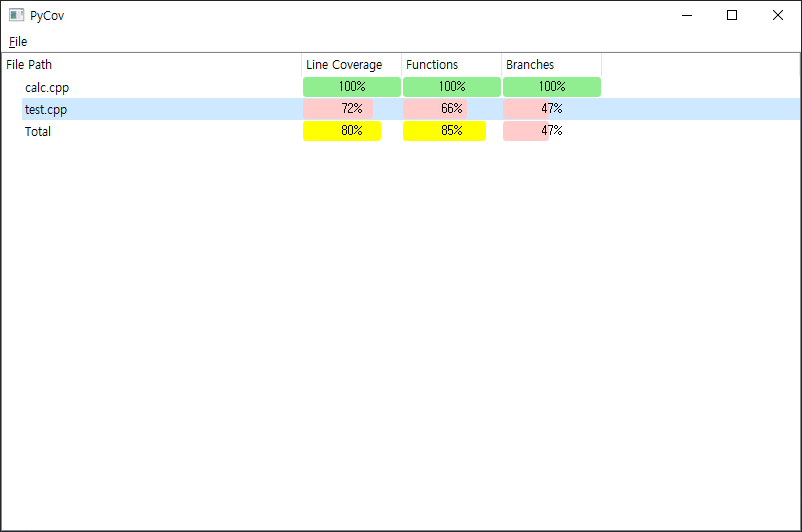

# PyCov
GCC/G++ coverage visualization tool.

## Generate gcov files

Build source files with -fprofile-arcs -ftest-coverage options.
Then generate gcov files using gcov with -bc options.

```
g++ test.cpp calc.cpp -fprofile-arcs -ftest-coverage 

./a.out

gcov test.cpp -bc
gcov calc.cpp -bc
```

## Main Window

Open the directory in which gcov files are generated using File -> Open menu.

Main window shows coverage metrics for each file and total coverage.



## Source code visualization

If a file is double clicked, source code visualization window shows source codes with coverage.


## Export

Coverage test report can be exported into HTML files via File -> Export menu.

index.html which is the main page of the coverage report.


test.cpp.html which is coverage visualization for a source code.


